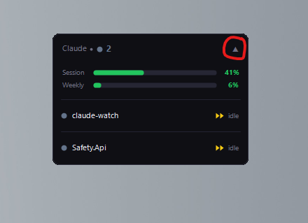
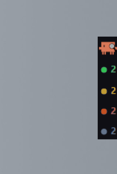

# Objective
To provide the option for a more densely packed Claude Watch so that it does not get in the way as much.

# Collapse Changes

Add a right-collapse icon next to the existing collapse (expand/chevron) icon. The icon is an arrow pointing into a pipe, `->|` (collapse to the right edge / enter dense mode). Its reversed form, `|<-`, means expand back out of dense mode.

`side-collapse-icon.png` is only a reference screenshot of the desired shape. The icon must be **drawn with GDI+ primitives**, not loaded from a PNG — use the same approach already used for the header chevrons (`▲`/`▼`) and the permission mode badges (`DrawModeBadge`, which draws the fast-forward chevrons with `FillPolygon`). Draw the arrow shaft + arrowhead + the pipe bar in code so it scales and themes consistently with the rest of the header.

Clicking this icon toggles dense mode. Clicking anywhere else in the header expands/collapses as it already does. The existing expand chevron is hidden while in dense mode.

# Dense Mode
Dense mode has two states: **closed** and **open** (hover-expanded).

## Closed

- Show the claude-watch icon at the top (just for flare).
- Below the icon, show one row per status **that has at least one session**, using the app's four statuses:
    - **Running** — green
    - **Awaiting input** — yellow (`input ↩`)
    - **Needs attention** — orange (`done ↩`)
    - **Idle** — grey
- Each row is the status dot/colour plus the session count for that status.
- Do **not** render a row for any status with a count of zero.
- If there are no sessions at all, show only the claude-watch icon (no count rows, no "0").

The closed strip is flush with the right edge of the screen.

## Open (hover-expanded)
When you hover over the closed strip, it expands to show the standard expanded UI, fixed/aligned to the right edge. Animate if possible, but not a deal breaker.

In this hover-expanded UI, the side-collapse icon is drawn in its **reversed** form (`|<-`). Clicking the reversed icon leaves dense mode and returns to the floating UI.

Automatically close the open state 750ms after the cursor leaves the UI.

When a session needs attention while collapsed in dense mode, flash the border **and** auto-open the hover-expanded popup (which then auto-closes after the cursor leaves), mirroring how floating mode auto-expands to surface the project that needs you.

## Dragging
When in dense mode, dragging on the header only adjusts position **vertically** — the strip stays hugging the right edge of the screen horizontally. (Multi-monitor handling is deferred for now; the strip simply hugs the right side of the screen.)

## Leaving dense mode
Floating and dense modes maintain their own sets of coordinates separately. When you leave dense mode, the floating UI is restored to wherever it was last dragged.

# Hot Key
Toggling to and from dense mode is possible with **alt + shift + w**. This is a system-wide global hotkey (registered via `RegisterHotKey`), so it works from any window regardless of focus. If another application already owns the combination, registration fails silently and the hotkey simply has no effect.

# Persistence
Nothing new is persisted. Dense-vs-floating state and the dense strip's Y position are held in memory for the session only. Every launch starts in floating mode at the top-right (unchanged from today).
