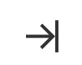

# Objective
To provide the option for a more densly packed claude watch so that it does not get in the way as much

# Collapse Changes

Add a right collapse icon like follows next to the existing collapse icon

Clicking on this should toggle dense mode. Clicking anywhere else in the header should expand/collapse as it already does. The existing expand icon should be hidden when in dense mode

# Dense Mode
Dense mode will have two states, open and closed.
In the closed mode it will look something like this

- show the claude-watch icon at the top (just for flare)
- list out the number of sessions based on their state (idle, needs attention, running, done)
    - if there are no sessions, show the idle icon with 0

When you hover over the closed version, it will expand to show the standard expanded UI, just fixed to the right. Animate if possible, but not a deal breaker.

Automatically close the open mode if there is no cursor action over the UI for 2 seconds.

## Dragging
When in dense mode, attempting to drag on the header will only allow adjustment vertically

## Leaving dense mode
When you leave dense mode, it should put the floating UI back to where the floating UI has been dragged to. Think of floating and dense mode having their own set of coordiates that are maintained separately

# Hot Key
Moving to and from dense mode should be possible with alt + shift + w